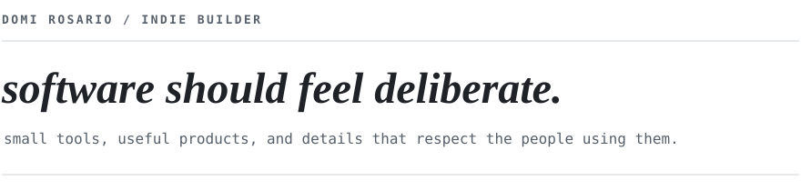
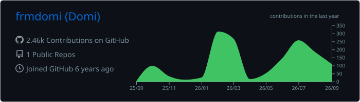

  

  <a href="https://domirosario.com">portfolio</a>&nbsp;&nbsp;·&nbsp;&nbsp;
  <a href="https://www.linkedin.com/in/domirosario/">linkedin</a>&nbsp;&nbsp;·&nbsp;&nbsp;
  <a href="https://x.com/domirosari0">x</a>

  building indie software at <a href="https://domirosario.com">domirosario.com</a> · contributing to <a href="https://github.com/DomiRosario/openship">OpenShip</a> · finishing an M.Sc. in Computer Science

 

<h3 align="center">working set</h3>

  &nbsp;&nbsp;&nbsp;
  &nbsp;&nbsp;&nbsp;
  &nbsp;&nbsp;&nbsp;
  &nbsp;&nbsp;&nbsp;
  &nbsp;&nbsp;&nbsp;
  &nbsp;&nbsp;&nbsp;
  

 

