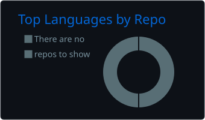
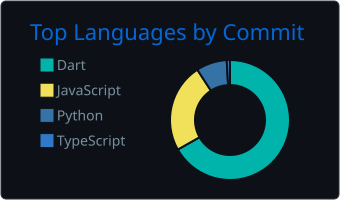

# hey, i'm domi

indie app builder. I care way too much about whether software feels good to use.

  

currently finishing an M.Sc. in Computer Science, building small useful products, and contributing where I can.

## currently

- building indie software at [domirosario.com](https://domirosario.com)
- contributing to [OpenShip](https://github.com/DomiRosario/openship), a self-hosted deployment platform
- interested in developer tools, privacy, and product craft

## by the numbers

  

  
  

